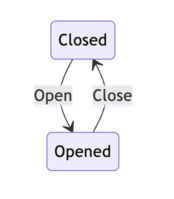
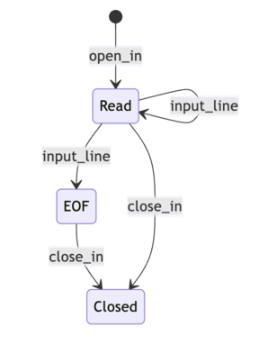

*Merci à [Grim](https://github.com/gr-im) d'avoir relu l'intégralité de cette série et de m'avoir donné un retour extrêmement complet qui me permet de vous proposer ces articles de **qualité**.*

*Il convient de souligner, avec la plus grande emphase, que si d'aventure une quelconque imperfection venait à être décelée au sein de cette série d'articles, la responsabilité de telles lacunes ne saurait, en aucune circonstance, être imputée à mon relecteur, mais uniquement à mon incapacité à appliquer à la lettre ses retours, ou à mon incompréhension.*

(j'ai écris ça avec chatgpt ptdr c trop stylé)

## Mini introduction *(parce que quand même)*

Cet article est le deuxième d'une série consacrée à la traduction en OCaml du papier [Typed design pattern for functional era](https://arxiv.org/abs/2307.07069). Si ce n'est pas déjà fait, je vous invite à lire [la première partie](https://hakimba.github.io/oxywa/articles/design-pattern-types-part-1.html). Cette fois-ci, nous allons nous intéresser à un problème beaucoup plus intéressant : **l'encodage d'une machine à état "sûre"** !

### Cas 2 : Une vraie machine à état

Je vais partir du principe, malheureusement, que vous êtes déjà familiarisé avec le concept de machine à état. Permettez-moi toutefois de le résumer brièvement : *les machines à état sont un outil permettant de modéliser le comportement d'un système en utilisant un ensemble d'états et des transitions entre ces états.*

Un exemple simple c'est toujours mieux :




Voici une machine à état qui représente une porte et l'utilisation usuelle qu'on peut faire d'une porte : l'ouvrir et la fermer. Nous avons deux états possibles, représentant respectivement la porte fermée et ouverte, ainsi que deux transitions permettant de passer d'un état à l'autre. 

Pour notre petit moment ensemble, nous allons prendre une machine à état un peu plus intéressante qui modélise un ensemble de manipulations possibles sur un fichier en OCaml.



Cette machine a état nous dit formellement que : 

- Je peux lire un fichier ouvert.
- Je peux fermer un fichier ouvert.
- Je peux lire un fichier ouvert jusqu'à ce que j'arrive à la fin du fichier, représentée par l'état EOF (end of file).
- Je peux fermer un fichier qui est lu en entier (EOF).
- Je peux fermer un fichier ouvert, qu'il ait déjà été entièrement lu ou qu'il puisse encore être lu.

Elle nous dit également ce que l'on ne peut pas faire : 
- Fermer un fichier déjà fermé.
- Lire un fichier qui a été intégralement lu.
- Lire un fichier fermé.

Si vous deviez implémenter cette machine à état, comment le feriez-vous ? Je pense qu'une première version naïve ressemblerait à ceci pour la plupart d'entre nous. *(je vais décrire la sémantique des fonctions via des commentaires)* :
```ocaml=
(* Notre fichier peut être dans trois états différents. *)
type state =
    | Readable (* En mesure d'être lu. *)
    | Eof (* Le fichier a déjà été entièrement lu. *)
    | Closed (* Fichier fermé. *)

(* Fonction qui prend un chemin vers un fichier et renvoie 
   le fichier ouvert empacté dans un état 'Readable' *)
let open_file file_path = Readable (open_in file_path)

(* Fonction qui va lire une ligne de notre fichier et 
   renvoyer la ligne ainsi que l'état du fichier *)
let read_line state = match state with
  | Readable in_c -> 
    (* Lire une ligne du fichier in_c et 
       renvoyer le contenu ainsi que l'état du fichier
     *)
  | Eof -> (* error !! : On ne peut pas lire un fichier déjà lu entièrement. *)
  | Closed -> (* error !! :  On ne peut pas lire un fichier fermé. *)
              
(* Vous avez compris... *)
let close_file state = match state with
    | Readable in_c -> (* Fermer le fichier et retourner un état Closed. *)
    | Eof in_c -> (* idem. *)
    | Closed in_c -> (* error !! : on peut pas fermer un fichier déja fermé. *)
```


Maintenant on va faire comme pour le premier article, on va se poser devant notre code et on va se demander avec beaucoup d'énergie : **Quels sont les problèmes de cette implémentation ?**

En apparence, elle semble respecter le contrat puisque les fonctions de transition effectuent leur traitement uniquement lorsque les conditions sont respectées. Cependant, cette vérification est effectuée pendant l'exécution. Et même si l'on décide de ne pas déclencher une exception en cas d'erreur. *(aka faire planter notre programme)* on va devoir alourdir notre programme pour gérer ces cas d'erreurs, qui devront apparaître au niveau des types et rendre la composition de nos transitions moins naturelles... Nous on veut se rapprocher du dessin. Et puis, une fois de plus, nos vérifications seraient faites **pendant l'exécution** du programme.

Pour illustrer tout cela, voici un exemple de manipulations problématiques que je pourrais effectuer avec ce code. :

```ocaml=
let _ main =

    let fichier_ouvert = open_file "why_js_sucks.txt" in
    let fermer_fichier = close_file fichier_ouvert in
    
    (* J'essaye de fermer un fichier déja fermé, oulala 
       je vais vraiment executer ce programme ? *)
    let encore_fermer_fichier = close_file fermer_fichier 
    
    (* Imaginez dans une fusée ??? *)
    let lire_un_fichier_fermé = read_line fermer_fichier
```

Le principal problème est que, contrairement à notre schéma de machine à état qui nous indique clairement les états attendus de chaque côté de nos transitions, notre code n'apporte aucune garantie statique vis-à-vis des états attendus de part et d'autre de nos transitions. Pourquoi ? Parce que tous nos états sont représentés par un seule **type somme** : state.

### Interlude type somme
Comme je ne suis pas sûr à 100% que mon **immense** audience sait ce qu'est un type somme, je vais faire une petite pause pour vous expliquer tout ce dont vous aurez besoin pour la suite. 

Partons d'un exemple simple. : 

```ocaml
type week_day
    | Monday
    | Tuesday
    | Wednesday
    | Thursday
    | Friday
    | Saturday
    | Sunday
```

On peut introduire la notion de type somme en l'opposant à celle de **type produit**. On avait vu un exemple dans l'article précédent : 

```ocaml
type user = {name : string; is_admin : bool}
```

On peut lire le type user comme : *"Une valeur de type `user` est composée d'un `name` **et** d'un `is_admin`"*

Alors que notre type `week_day` va se lire : *"Je peux **construire** 7 valeurs de **type** `week_day` : Monday, **ou** Tuesday, **ou**..."*. Et pour aller plus vite, on dit que Monday, Tuesday, etc. sont des **constructeurs**.

Et on peut déconstruire ce type en son ensemble de constructeurs via le pattern matching *(maintenant présent dans pas mal de langages mainstream)* : 

```ocaml
let is_week_end day = match day with
    | Saturday | Sunday -> true (* Si day est Saturday OU Sunday, c'est vrai *)
    | _ -> false (* Dans tout les autres cas, c'est faux *)
```

Un constructeur peut également prendre des arguments de type arbitraires, donc quelque chose de simple comme : 

```ocaml
type primitif =
    | Int of int
    | String of string
    
let int_prim = Int 6
let str_prim = String "test"
```

Ou encore plus intéréssant, avec des constructeurs qui prennent en argument des valeurs de types sommes/produit que vous avez définis, on peut tout mixer ensemble ! : 

```ocaml
type armor_stat = {
  rizz: int;
  weight: int;
  thickness: int
}
type armorId = CheapJogging | GoldArmor | SilverArmor | BronzeArmor
               
type armor = {id: armorId; stats : armor_stat}

(* prend une quantité qui représente un dégat et renvoie une partie 
   que l'armure n'aura pas amortie
*)
let armouring_damage dmg curr_armor = match curr_armor.armorId with
    | CheapJogging -> dmg
    | BronzeArmor ->
        curr_armor.thickness / dmg
    | SilverArmor -> (curr_armor.thickness / dmg) - (0.1 * dmg)
    | GoldenArmor -> 0
```

Allons encore plus loin, en introduisant une notion que les programmeurs objets connaissent très bien aussi : la généricité, ou ici, le polymorphisme **paramétrique**

Dans le précédent article, on avais ce bout de code : 

```ocaml
(*
    Le type "t option" nous permet de représenter 
    un calcul qui peut, ou non, renvoyer une valeur de type t.
*)
let as_admin (u : user) : admin option =
    if u.is_admin then Some (Admin u) else None
```

Mais on avais pas concrètement vu la définition d'option, la voici : 

```ocaml
(* Polymorphisme paramétrique, car notre type est paramétré 
   par un autre type, qui est générique. 
   C'est une variable de type, elles sont préfixées 
   par une apostrophe pour être reconnaissables. *)
      |
      v
type 'a option =
    | Some of 'a
    | None
    
    (* Notre variable de type est instancié par le type int *)
                  |
                  v
let int_option : int option = Some 6
let string_option = Some "test"

(* Ici le compilateur a déduit le type le plus général
   Comme on fait un Some de None on a pas fixé de type comme les
   deux autres exemples *)
let option_option : 'a option option = Some None

(* le type de cette fonction : 'a option -> 'a -> 'a *)
let getOrDefault opt default = match opt with
    | Some v -> v
    | None -> default
    
```

On peut également avoir un type parametré par plusieurs types, et c'est très utile en fait : 

```ocaml=

(* Ce type représente les deux issues possible d'un calcul :
   Une erreur, ou un succès *)

type (‘a,’b) result =
    | Error of ‘a
    | Success of ‘b

let division a b : (string,int) result =
    if b == 0 then Error "division par 0"
    else Success (a/b)
```

Les deux constructeurs du type result ont beau avoir deux paramètres de types différents, non seulement ces deux variables doivent être déclarées au niveau du nom du type, mais en plus `Error` et `Success` habiterons tout les deux le type `(‘a,´b) result` une fois construit.

**Enfin**, Les types sommes peuvent être **récursifs**. Je pense que l'exemple le plus simple et parlant est celui des listes. OCaml définit le type des listes à peu près de cette manière. : 

```ocaml
(* Une liste c'est soit : 
    - une liste vide
    soit
    - la construction d'une nouvelle liste
      en prenant une valeur qu'on vient coller
      a la tete d'une autre liste
*)
type 'a myList
    | Nil (* type recursif parce qu'on référence 
            le type dans sa définition *)
                   |
                   v
                 -------
    | Cons 'a * 'a myList
    
let empty_list = Nil
let one_el_list = Cons(6,empty_list)
let two_el_list = Cons(7,one_el_list)

(* OCaml permet d'écrire ça plus simplement avec son type natif list *)

let two_el_list : int list = 7 :: 6 :: []
let two_el_list = [7;6]
```

Les types sommes sont riche et je vais assez vite, ce n'est pas exhaustif, mais ça suffiras pour nous !

### Retour à notre problème.

Alors, avant cette appartée sur les types sommes, on s'étaient arreté à 

```ocaml
(* Notre fichier peut être dans trois états différents. *)
type state =
    | Readable (* En mesure d'être lu. *)
    | Eof (* Le fichier a déjà été entièrement lu. *)
    | Closed (* Fichier fermé. *)
```

> notre code n'apporte aucune garantie statique vis-à-vis des états attendus de part et d'autre de nos transitions. Pourquoi ? Parce que tout nos états sont représenté par un seul **type somme** : state.
> 

Maintenant que vous savez tous ce qu'est un type somme, vous avez compris qu'une fonction qui attend une valeur de type state, elle peut recevoir n'importe lequel des trois états, donc on est obligé de tout vérifier dynamiquement, en gros on laisse entrer tout et n'importe quoi dans nos fonctions de transitions et on se dit *"on verra une fois sur place"*
*(je deteste cette phrase, arretez de me dire ça, je suis un control freak, je prévois tout a l'avance)*.

Bon, du coup, on aimerait contrôler plus finement les états qui peuvent être envoyés en argument de nos fonctions et que nos fonctions renvoient. Finalement, si on reprend l'implem naive, on aimerais que les types de nos fonctions soient comme ça : 

```ocaml=
             (* type de l'argument *)
                     |               (* type de sortie de la fonction *)
                     |                      |
                     v                      v
              ----------------    ---------------
let read_line (state: Readable) : Readable ou Eof

let close_file (state: Readable ou Eof, les deux me vont poto) : Closed
```

Notre objectif va être de nous rapprocher le plus possible du caractère formel de notre dessin de machine à état, en ne pouvant compiler qu'un programme qui respecte strictement ses règles. Et pour réussir cet exploit, on va se servir de deux fonctionnalités particulière d'OCaml : **les types algébrique généralisés** et **les variants polymorphes**.


### Les GADTs

Les **GADTs**, ou *types algébrique généralisées*, sont une extension extrêmement puissante de nos fameux **types sommes**. les GADTS introduisent plusieurs notions importantes qui redéfinissent en partie notre rapport a nos types sommes. Par exemple, l'un des fondamentaux dont j'ai parlé quand je vous ai expliqué les types sommes, c'est que tous les constructeurs d'un type construisent tous **exactement** le type en question, si c'est un type polymorphe, ils fixeront tous le même paramètre de type.

Avec les GADTs, ce n'est plus nécessairement le cas. Je peux écrire un type dont les constructeurs fixeront chacun à leur manière le paramètre de type.

```ocaml=
type 'a expression = 
    (* Donne moi un int, et je construirais un type int expression *)
  | Int : int -> int expression
  | String : string -> string expression
  | Bool : bool -> bool expression
```

Vous remarquerez que, contrairement à un type somme paramétré classique, on ne fait aucune référence à notre variable de type dans sa définition. Du coup, on aurait pu l'écrire comme ça : 

```ocaml=
type _ expression = 
  | Int : int -> int expression
  | String : string -> string expression
  | Bool : bool -> bool expression
```

Vous pourriez vous demander en quoi c'est si utile que ceçala en comparaison à une expression classique ? 

```ocaml=
type Sexpression = 
  | SInt of int
  | SString of string 
  | SBool of bool 
```

Eh bien, un premier élément de réponse peut être exposé en essayant de faire du pattern matching sur notre GADT. Si on prend nos deux types d'expressions et qu'on écrit ces deux fonctions respectivement : 

```ocaml=

let f (e: _ expression) = match e with
    | String s -> s
    
let g (e : Sexpression) = match e with
    | SString s -> s

```

La fonction `f` va compiler, et OCaml va déduire ce type pour la fonction : 

`string expression -> string`

Ehhh oui ! Comme notre constructeur `String` fixe tout seul dans son coin le parametre du type, ce pattern matching est exhaustif, on a traité tout les cas du type `string expression`, par contre pour la fonction `g`...

```
Warning : this pattern-matching is not exhaustive.
Here is an example of a case that is not matched:
(SInt _|SBool _)
```

Ça ne compile pas ! Et le message d'erreur est assez clair, on ne traite pas tous les cas du type `Sexpression`, car nos trois constructeurs construisent exactement ce type !

Peut être que vous voyez déjà où je veux en venir avec tout ça, et que vous vous dite *« **oh my god** (j'essaye d'inclure les anglophones) quel outil de modélisation impressionnant, j’imagine qu’on va vouloir 3 constructeurs qui fixent chacun un parametre de type représentant un état pour avoir un type différent par état ? »*

Oui c’est exactement ça en fait. Mais si vous essayiez instinctivement avec ce qu'on a appris, y’a des chances que vous essayiez de faire ça

```ocaml=
type _ state =            (*oh j'aimerais tellement faire ça*)
                                |
                                v
  | Readable : in_channel -> Readable state
  | Eof : in_channel -> ... 
  | Closed : in_channel -> ...
```

C'est pas de l'OCaml valide, mais ça peut le devenir assez facilement : 


```ocaml=
type readable = Readable
type eof = Eof
type closed = Closed

type _ state =
  | Readable : in_channel -> readable state
  | Eof : in_channel -> eof state
  | Closed : in_channel -> closed state
```

Maintenant on a notre GADT qui décrit ce qu'on avait imaginé ! Et on peut écrire la fonction 

`let open_file file_path = Readable (open_in file_path)` ça fonctionne très bien.

Par contre, pour `read_line`et `close_line`, si on se remémore notre spécification. *(enrichi avec les nouveaux types qu'on a créés.)*, ce qu'on voudrais décrire en terme de type, c'est : 

```ocaml=
             (* type de l'argument *)
                       |             (* type de sortie de la fonction *)
                       |                             |
                       v                             v
              ----------------------     --------------------------
let read_line (state: readable state) : readable state ou eof state

let close_file 
(state: readable state ou eof state, les deux me vont poto) : closed state
```

Et les constructions vis a vis des types qu'on a vu jusqu'a maintenant ne nous permettent pas de décrire un type comme `readable ou eof`

Heureusement, ce sacripan d'OCaml nous offre une construction pour arranger ça !

#### Les variants polymorphes

OCaml nous donne un moyen de créer a la volée des constructeurs de type qui n'appartiennent a aucun type définis dans le programme. Contrairement a un constructeur classique qu'on attache a un type `t` comme : 

```ocaml
type t = 
    Construct
```

Un variant polymorphe n'a pas besoin d'etre déclaré/définis quelque part, on peut directement l'utiliser comme valeur : 

```ocaml
let user = `User ("gholad",28)
```

Eux, ils sont libre comme l'air, youhouuu. Regardons le type de notre valeur user : 

```ocaml 
[> `User of string * int ]
```

C'est curieux, non ? Notre type est contenu entre crochets, avec un ">" au début. En fait, c'est très intéressant. Les variants polymorphes, n'étant rattachés à aucun type, on peut imaginer qu'ils sont contenus dans un ensemble hypothétique de variants.

En voyant les choses comme ça, dans notre exemple ça veut dire *"le type de \`User c'est un ensemble ou il y'a au moins le variant User"*.  Notre type \`User pourra etre composé avec un autre ensemble de variant polymorphe (lui aussi ouvert) plus tard. Et on va voir que c'est très utile.

A l'inverse, si j'ai `[< variant1 | ... | variantN]`, ça veut dire *"ce type est strictement cet ensemble de variants"*

On peut jouer un peu avec pour comprendre comment ça fonctionne : 

```ocaml
(* on ne décrit qu'un constructeur, 
   donc ensemble fermé avec ce constructeur *)
        |
        v
(* f : [< `Foo ] -> unit *)
let f x =
  match x with
  | `Foo -> ()
  
(* g : [< `Bar | `Foo ] -> unit *)
let g x =
  match x with
  | `Foo -> () | `Bar -> ()
  
  (* Comme on décrit deux constructeurs, et qu'on dit
     "pour tout le reste, renvoie unit"
     l'ensemble des variants est ouvert avec au moins
     Foo et Bar *)
        |
        v
(* h : [> `Bar | `Foo ] -> unit *)
let h x =
  match x with
  |`Foo -> () | `Bar -> ()
  | _ -> ()
  
let foo_of_bar x = if x then `Foo else `Bar

let () = f `Foo (* compile ! *)
let () = g `Foo (* compile ! *)
let () = g (foo_or_bar true) (* compile ! *)
let () = f (foo_or_bar false) (* ne compile pas ! *)
```

Avec ces deux armes que représentent les GADTs et les variants polymorphes on peut maintenant encoder notre machine a état ! Commençons par notre fameux type `state` 

```ocaml=
type _ state =
  | Readable : in_channel -> [>`Readable] state
  | Eof : in_channel -> [>`Eof] state
  | Closed : in_channel -> [`Closed] state
  
```

Plusieurs trucs intéréssant : 
* Comme on veut pouvoir exprimer des contraintes comme : readable ou eof, les deux variants polymorphes [> \`Readable] et [> \`Eof] sont ouvert, et pourront donc etre composé.
* Une fois que le fichier est fermé, on ne peut plus l'utilisé, donc le variant polymorphe [\`Closed] est fermé *(pas besoin du `<`, c'est fermé par défaut).*

A partir de ce type, on va pouvoir écrire l'API sûre vis-à-vis de la spécification que nous nous sommes fixée. La fonction `open_file` reste le même !

```ocaml
let open_file path = Readable (open_in path)
```

La fonction `read_line` va consommer une ligne du fichier et la retourner accompagnée du nouvel état

```ocaml
let read_line (state : [`Readable] state) : string option * [`Readable | `Eof] state = match state with
  | Readable in_c -> 
    try 
      let line = input_line in_c in
      Some line, Readable in_c
    with
    End_of_file -> None,Eof in_c
```

Et enfin, la fonction `close_file`
```ocaml
let close_file (state: [< `Readable | `Eof] state) : [`Closed] state = match state with
    Readable ic | Eof ic -> close_in ic;Closed ic
```

Quelques points pour conclure : 
* Notre GADTs `state` nous permet de tracker l'état du fichier.
* Les variants polymorphes nous permettent de décrire des fonctions qui peuvent prendre plusieurs états, un outil de modélisation indispensable lorsque l'on souhaite décrire une machine a état, ou il est courant d'avoir plusieurs transitions possible pour un état.

En tout cas, c'est gagné ! On a notre machine a état qui nous oblige a utiliser les bons états avec les bonnes transitions : 

```ocaml=
let main_state_m () =
  let data = open_file "enfin_fini_cet_article_de_con.txt" in
  let rec loop d =
    match read_line d with
      ...
      ...
      (*... je lis le fichier jusqu'a atteindre la fin*)
  in
  let eof_state = loop data in
  
  (* La ligne suivante ne compile pas : 
     on essaye de lire un fichier qui 
     a été lu entièrement *)
  let illegal_use1 = read_line eof_state in
  
  (* Tout va bien, on ferme le fichier ici *)
  let closed_file = close_file eof_state in
  
  (* La ligne suivante ne compile pas : 
     on essaye de fermer un fichier déja fermé *)
  let illegal_use2 = close_file closed_file in
  
  closed_file
```

### Conclusion

Alors, j'avais menti ? Je vous avais prévenu que cette partie serait beaucoup plus intéressante, on a vu tout plein de trucs trop cool et puis c'est **tellement bien expliqué** franchement...

En fait, je sais pas trop comment conclure, à la base cette série d'articles c'était un seul immense article que personne n'aurait lu et que personne a voulu relire à part *[Grim](https://github.com/gr-im)*. Le fait de l'avoir découpé en trois m'oblige à écrire trois introductions et trois conclusions, et c'est définitivement le truc le plus dur que j'ai eu à faire dans tout le processus de création de cette série d'articles *(vous avez vu comment je meuble ?)*

J'espère que vous trouvez ça super cool de pouvoir encoder des contraintes dans les types de nos programmes pour raffiner le plus possible l'espace des bugs qui pourront arriver à l'exécution du programme. Et également écrire des API agréable a utiliser ! La prochaine partie est encore plus impressionnante et on va aller encore plus loin, oui oui ! ça va être **magique**.

Bon, j'ai des pains à hot-dog à aller cuisiner, n'hésitez pas à me faire des retours, poser des questions, me corriger, sur LinkedIn, Slack, Twitter, peu importe, ça fait toujours plaisir ! 

**Bisou !**