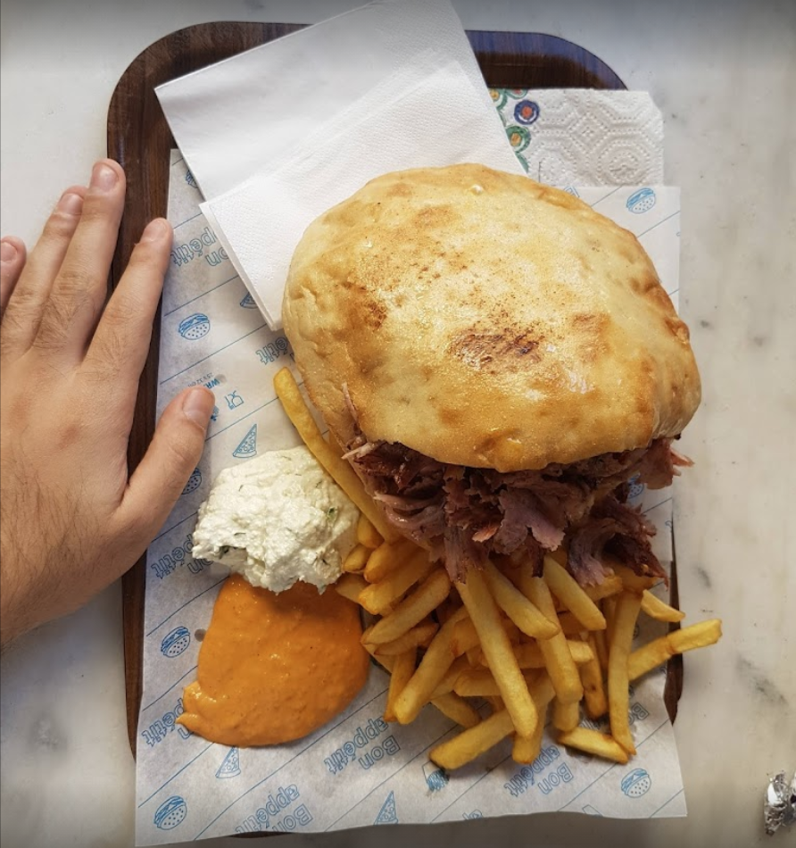
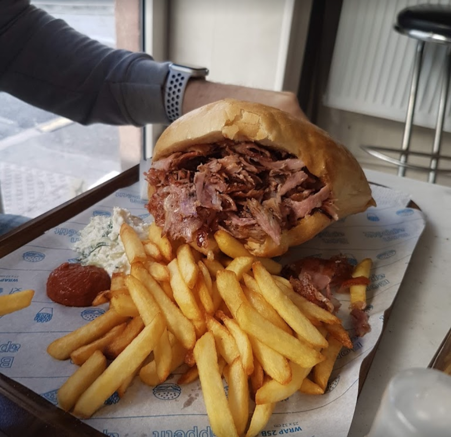

## Le meilleur kebab d'ile de france

D'abord, pour situer correctement, voici un extrait de la page wikipedia qui parle de l'Île-de-France.

>L'Île-de-France, est une région historique et administrative française. Il s'agit d'une région très >fortement peuplée, qui représente à elle seule 18,8 % de la population de la France métropolitaine sur seulement 2,2 % de sa >superficie, ce qui en fait la région la plus peuplée (12,40 millions d'habitants en 2022) et la plus densément peuplée (1 017 >hab/km2) de France. 

Dans cette région, se trouve une ville, Melun, souvent moquée. : 

- ["Melun c'est loin"](https://youtube.com/clip/UgkxdHYQGxbn70eadH76bKmWfUVq1bTab99g)
- ["Prof d'EPS a melun"](https://www.youtube.com/shorts/o9CEiNCHigo)
- ["Je suis pas pret a mourir pour melun"](https://youtube.com/clip/UgkxD_Ln7bmAryHQ7O-Bx_p7dKTl_TgXel2z)

Vous remarquerez que, à peine le nom de Melun prononcé, les gens rient aux éclats, je ne parlerais pas des raisons dans cet article (peut-être dans un autre). Cependant, tout proche de la gare, et du cinéma les variétés (ou les Melunais jouissent du doux prix de 5 euros la séance.), se trouve **Papa grill**.

**Papa grill** est un kebab qui existe depuis plus de 25 ans, ou l'ingrédient principal : la viande, est faite maison et est excellente, c'est généreux, c'est simple, c'est très bon.

Alors pourquoi le meilleur d'île-de-France ? Parce que j'en ai essayé beaucoup, énormément, tout les soit disant "meilleur", et ils sont tous moins bien. Même les rares kebabs qui se sont approchés du goût de la viande du **Papa grill** péchaient à d'autres endroits, comme le prix ou la générosité. La carte est garnie, mais en vérité, c'est très simple, vous avez le traditionnel *(tradition qui se perd de nos jours en france)* choix entre un pain **ENTIER**, et un pain **DEMI**, une taille de kebab classique, c'est un demi, l'entier, c'est pour les gros mangeurs (comme moi). Voici quelques photos pour illustrer l'ENTIER : 

Un autre angle pour voir la viande

Impressionnant non ? (ces images ne sont pas de moi.).
Vous pouvez aussi demander votre demi ou votre entier dans une crêpe [durum](https://fr.wikipedia.org/wiki/D%C3%BCr%C3%BCm), ils se distinguent par le fait que la quantité de viande nécessaire pour être appelé un demi est contenue dans une seule crêpe, alors que l'entier nécessite deux crêpes.

Pour éviter tout malentendu et tout moment de gêne dont j'ai déjà été témoin, je vais vous simuler une prise de commande au Papa grill pour que vous puissiez vous entraîner : 

- "Bonjour"
- "Bonjour, sur place ou a emporté ?"
- "Sur place svp, donc ce seras un demi, sauce blanche, salades oignons" (vous pouvez demander vos oignonq cuit, ils seront un peu caramelisé c'est un délice)
- "Avec frites ?"
- "Oui"
- "Ok c'est bon"
- "Merci"

En disant *"un demi svp"* a la place de *"un grec svp"* ou *"un kebab svp"*, croyez moi, vous passerez pour un vrai melunais.

Si d'aventure vous vient l'envie de venir l'essayer, vous devez faire attention, parce qu'officiellement, il y a deux Papa grill a Melun, mais il n'y a qu'un seul meilleur kebab d'Île-de-France, vous avez un **26 Bd Gambetta, 77000 Melun**, et un **3 Rue des Grandes 77000 Melun**, c'est le deuxième où il faut aller. Et une fois que vous y avez mangé, envoyez moi un email a hakim.baaloudj@gmail.com pour me donner votre avis, j'en serais vraiment ravis..

**C'est pas un placement de produit**